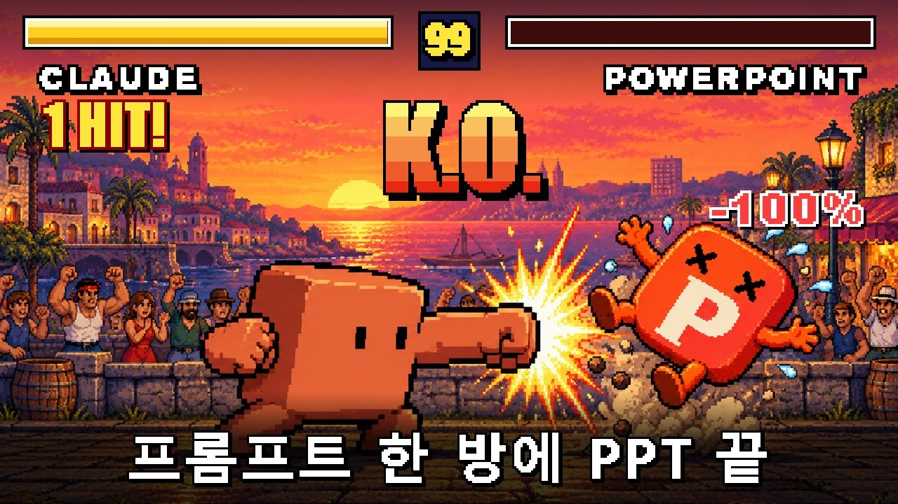
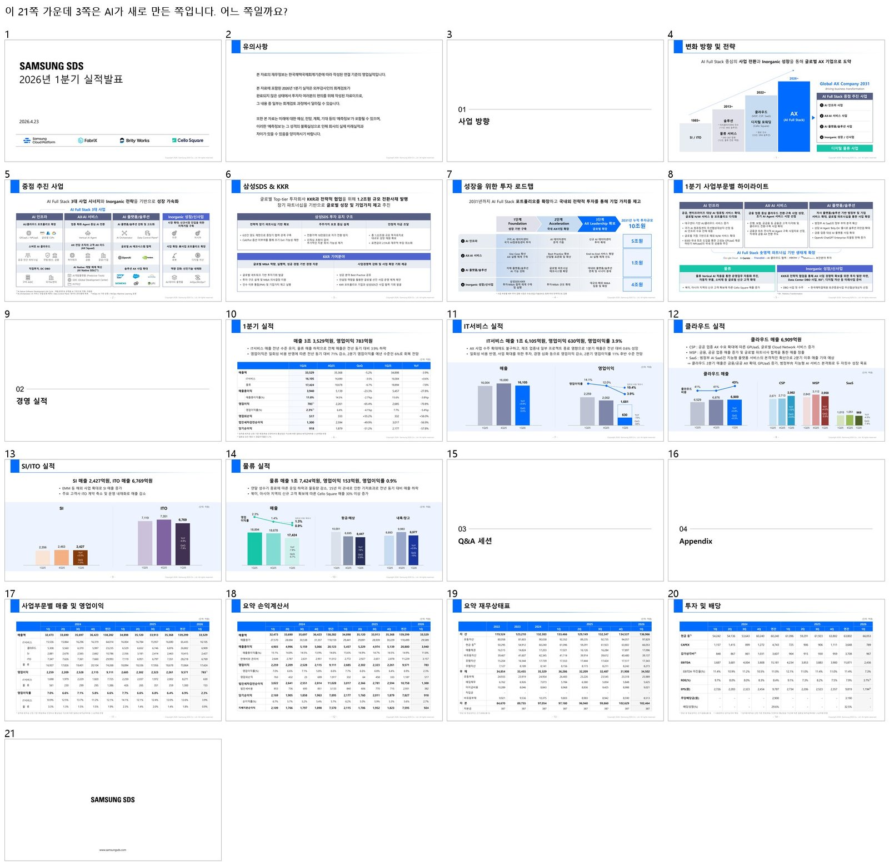
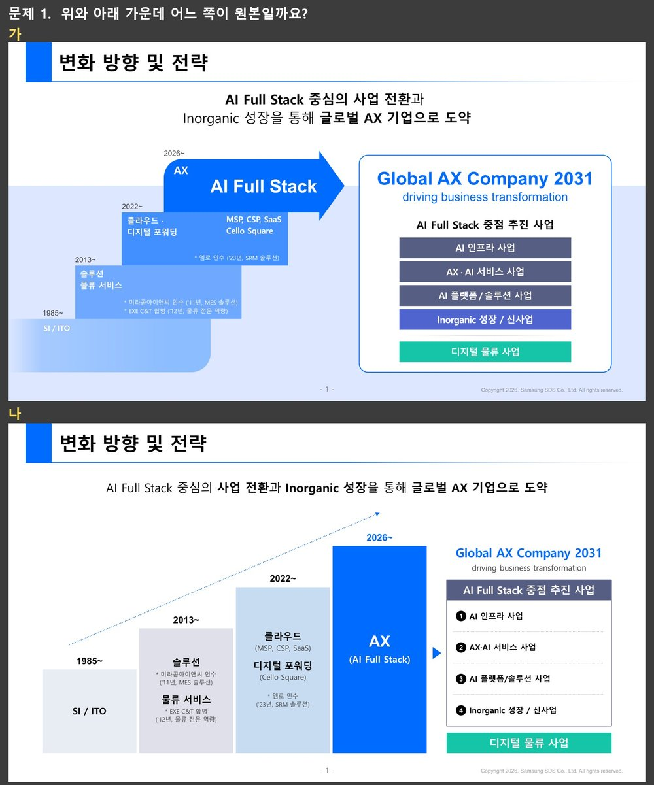
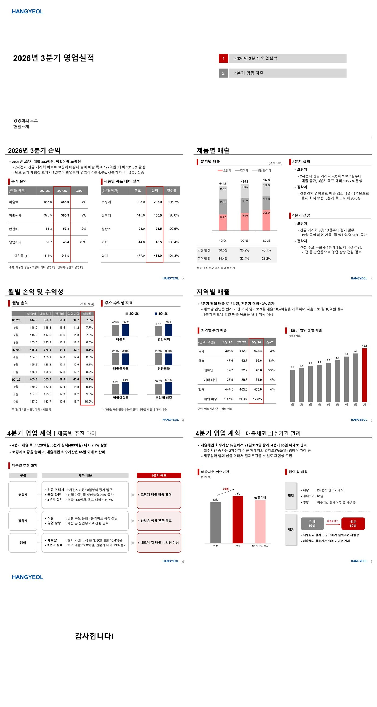
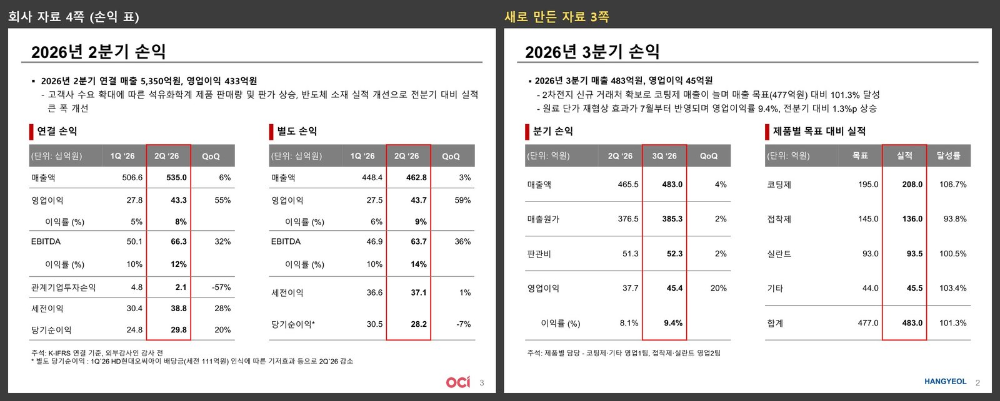
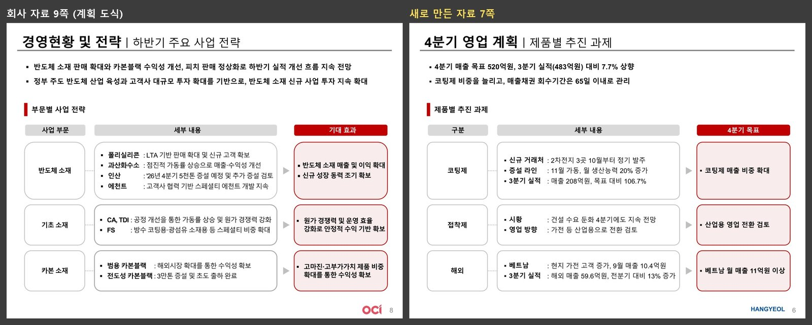
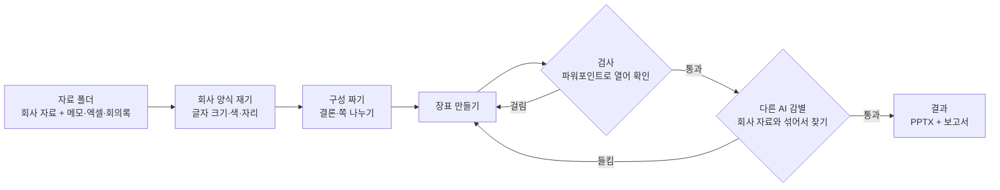

<p align="center">
  
</p>

<h1 align="center">company-deck</h1>
<p align="center"><b>프롬프트 한 방에, 우리 회사 양식 그대로인 발표 자료가 나옵니다.</b></p>

<p align="center">
  
  
  
  
</p>

---

## 먼저, 문제 하나

아래는 삼성SDS가 공시한 2026년 1분기 실적발표 자료 21쪽입니다. **이 중 3쪽은 회사가 아니라 AI가 만들었습니다.** 어느 쪽일까요?

<p align="center"></p>

<details>
<summary><b>정답 보기</b></summary>

<br>

**4쪽, 5쪽, 6쪽**입니다.

회사 자료에서 이 세 쪽을 빼고, AI에게 남은 쪽만 보여 준 다음 같은 내용으로 다시 만들게 했습니다. 사람은 도형 하나 옮기지 않았습니다.
작업을 전혀 모르는 다른 AI에게 21쪽을 통째로 보여 주고 AI가 만든 쪽을 찾게 했을 때도, 쪽마다 6번 중 0~2번만 맞혔습니다.

</details>

하나 더. 위와 아래 가운데 어느 쪽이 원본일까요?

<p align="center"></p>

<details>
<summary><b>정답 보기</b></summary>

<br>

원본은 **가(위)**, AI가 만든 쪽은 **나(아래)**입니다.

</details>

---

## 실제로는 이렇게 씁니다

위 문제는 "얼마나 똑같이 따라 하나"를 시험한 것입니다. 실제로 쓸 때는 **회사 발표 자료 하나 + 이번에 쓸 자료**만 넣으면 됩니다.

넣은 것 (정리하지 않았습니다)

- OCI가 공개한 실적발표 자료 21쪽 (양식만 빌림)
- 대충 쓴 메모 12줄
  > 3분기 매출 목표 넘음. 특히 코팅제 잘 팔림 / 접착제는 좀 빠짐.. 건설경기 영향 / 문제: 매출채권 회수 기간 늘어남. 62일 → 71일. 이거 꼭 넣어야 함 / 로고는 우리 로고로 바꿔주고 회사 이름은 한결소재 / 장표는 10장 안으로
- 월별 실적 엑셀 (시트 4개, 담당자 칸과 빈 시트까지 그대로)
- 지난주 회의록, 로고 파일

받은 것 (19분, 가상 회사 "한결소재"의 3분기 영업실적 보고 9쪽)

<p align="center"></p>

왼쪽이 회사 자료, 오른쪽이 새로 만든 쪽입니다.

<p align="center"></p>
<p align="center"></p>

- 결론은 메모와 엑셀을 보고 AI가 정했습니다: 목표 달성 → 이익률 상승 → 매출채권 문제 → 4분기 목표.
- 엑셀에 없는 분기 합계와 비율은 계산해서 넣고, 계산식을 보고서에 남겼습니다.
- 회의록에서는 누가 무슨 말을 했는지는 빼고 결정된 것만 가져왔습니다.
- "10장 안으로"도 지켰습니다.

---

## 다른 AI PPT 방법과 뭐가 다른가요?

| | 흔한 방법 | company-deck |
|---|---|---|
| 회사 양식 맞추기 | 템플릿에 글자만 채우거나, AI가 눈으로 보고 비슷하게 | 회사 자료의 글자 크기, 색, 제목 자리를 **코드로 재서** 그대로 |
| 사람이 하는 일 | 단계마다 지시하고, 결과 보고 "이거 고쳐 줘"를 반복 | **자료 넣고 프롬프트 한 번** |
| 검사 | 사람이 눈으로 | AI가 **파워포인트로 직접 열어** 검사하고, 작업을 모르는 **다른 AI가 회사 자료와 섞인 쪽에서 AI가 만든 쪽을 찾게** 함. 들키면 스스로 고침 |
| 숫자 | 가끔 지어냄 | 자료에 있는 숫자만. 계산한 숫자는 계산식을 남김 |
| 결과물 | 그림이나 HTML인 경우가 많음 | 글자, 표, 차트를 모두 고칠 수 있는 **진짜 PPTX** |

---

## 어떻게 동작하나요?

AI가 혼자 만들고, 검사하고, 고치는 것을 통과할 때까지 돌립니다(루프 엔지니어링).



이 매뉴얼은 제작을 여러 번 돌리면서 검사에 걸리고 감별에 들킨 것을 모두 모아 만들었습니다. 특정 회사 값은 없고, 회사마다 다른 값은 매번 도구가 그 회사 자료에서 잽니다. 그래서 처음부터 같은 실수를 하지 않습니다.

| 시험 | 걸린 시간 | 만드는 데 든 비용 (API 정가로 환산) | 사람에게 물은 횟수 |
|---|---|---|---|
| 삼성SDS 자료, 빠진 3쪽 다시 만들기 | 27분 | 약 6달러 | 0 |
| OCI 양식, 정리 안 된 메모·엑셀로 9쪽 | 19분 | 약 6달러 | 0 |

모델은 Claude Opus 5.5입니다. 구독 요금제로 쓰면 따로 돈이 들지 않고, 사용량만 씁니다.

---

## 시작하기

**준비물**: 파워포인트, Claude 유료 요금제(월 20달러 프로 이상), Claude 데스크톱 앱의 Code 탭

**1. 폴더 만들기**

빈 폴더를 만들고 그 안에 `자료` 폴더를 만듭니다. `자료` 폴더에 넣습니다.

- 회사 발표 자료 하나 (PPT 파일이나 PDF)
- 이번 발표에 쓸 자료 전부 (메모, 엑셀, 회의록, 워드, 로고 무엇이든. 정리하지 않아도 됩니다)

**2. 프롬프트 붙여 넣기**

Claude 앱의 Code 탭에서 그 폴더를 열고, 아래를 그대로 붙여 넣습니다.

```
https://github.com/kyusieun/company-deck 에 있는 company-deck 스킬을 이 폴더의 .claude/skills 에 설치하고, 설치한 SKILL.md를 읽고 그대로 따라 줘.
자료 폴더에 우리 회사 발표 자료랑 이번 발표에 쓸 자료들(메모, 엑셀, 회의록 같은 것)을 넣어 뒀어. 회사 양식 그대로 발표 자료 만들어 줘.
자료에 없는 내용은 지어내지 말고, 나한테 묻지 말고 끝까지 해 줘.
```

필요한 프로그램(파이썬, Node 등)이 없으면 AI가 확인하고 설치합니다.

**3. 결과 받기**

`결과` 폴더에 생깁니다.

| 파일 | 내용 |
|---|---|
| `발표자료.pptx` | 파워포인트에서 바로 고칠 수 있는 결과 |
| `발표자료.pdf` | 미리 보기 |
| `보고.md` | AI가 정한 결론과 이유, 계산한 숫자와 계산식, 채워야 할 칸 |

---

## 자주 묻는 질문

<details>
<summary><b>쪽 구성을 내가 정하고 싶어요</b></summary>

메모에 적으면 그대로 따릅니다. 예: "표지, 요약, 실적, 계획, 요청 사항 순으로 5장".
</details>

<details>
<summary><b>자료에 없는 정보(발표일, 연락처 등)는 어떻게 되나요?</b></summary>

지어내지 않고 그 자리에 `[자료 없음: 연락처]`, `[확인 필요: 발표일]`처럼 표시합니다. 보고서에 채워야 할 칸 목록이 따로 나옵니다.
</details>

<details>
<summary><b>로고나 회사 이름을 바꿀 수 있나요?</b></summary>

메모에 "로고는 우리 로고로" 라고 쓰고 로고 그림을 자료 폴더에 넣으면, 회사 자료의 로고 자리에 바꿔 넣습니다.
</details>

<details>
<summary><b>맥에서도 되나요?</b></summary>

윈도우에서 시험했습니다. 맥에서 도구가 막히면 AI가 다른 방법을 찾아 진행하도록 매뉴얼에 적어 두었습니다.
</details>

<details>
<summary><b>회사 글꼴이 없으면요?</b></summary>

가장 가까운 설치 글꼴로 바꾸고 보고서에 적습니다. 회사 글꼴이 깔려 있어야 똑같은 모양이 나옵니다.
</details>

<details>
<summary><b>한글(hwp) 파일도 되나요?</b></summary>

읽지 못합니다. PDF로 저장해서 넣어 주세요.
</details>

---

## 알아 둘 것

- **숫자는 마지막에 한 번 직접 확인하세요.** 자료와 대조해 검사하지만, 회사에 나가는 숫자는 사람이 한 번 봐야 합니다.
- **회사 자료를 AI에 올려도 되는지** 회사 규정을 먼저 확인하세요.
- 새로 만든 쪽이 회사 자료와 완전히 같지는 않습니다. 다른 AI 감별사는 가끔 차이를 짚어 냅니다(상자 높이, 빈 공간 같은 것). 사람이 보기에 구별이 잘 안 되는 수준을 목표로 합니다.
- 위 예시의 삼성SDS, OCI 자료는 누구나 받을 수 있는 공개 IR 자료입니다. OCI 예시는 양식만 빌렸고 내용은 가상 회사입니다.

---

<p align="center">
도움이 됐다면 ⭐ 를 눌러 주세요.<br>
유튜브 <b>AI는 훌륭하다</b>에서 만드는 과정을 보여 드립니다.
</p>
