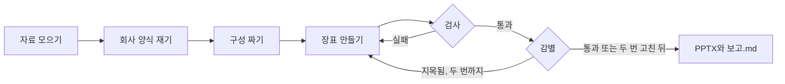

# company-deck

[](LICENSE)

회사 발표 자료 한 벌을 양식으로 삼아, 메모·엑셀·회의록으로 새 발표 자료를 만드는 Claude Code 스킬입니다.

회사 자료의 글자 크기, 색, 제목과 쪽 번호 자리를 코드로 재서 장표를 만들고, 파워포인트로 열어 검사합니다. 그다음 작업 내용을 모르는 다른 AI에게 새 쪽과 회사 자료 쪽을 섞어 보여 주고 새 쪽을 골라내게 합니다(아래에서 "감별"). 지적받은 곳을 두 번까지 고치고, 남은 문제는 보고서에 적습니다. 결과는 파워포인트에서 글자, 표, 차트를 고칠 수 있는 PPTX입니다.

## 예시

### 메모·엑셀·회의록으로 만든 분기 실적 보고

OCI의 공개 실적발표 자료(21쪽)를 양식으로 쓰고, 가상 회사 "한결소재"의 3분기 영업실적 자료를 넣었습니다. 자료는 정리하지 않았습니다.

- 메모 12줄. 결론은 적지 않았고, "장표는 10장 안으로", "로고는 우리 로고로 바꿔주고 회사 이름은 한결소재" 같은 요청이 들어 있습니다.
- 월별 실적 엑셀. 시트 4개에 담당자 칸과 빈 시트가 그대로 있습니다.
- 회의록, 로고 그림.

9쪽이 나왔습니다. 명령줄에서 약 19분 걸렸고, 중간에 사람에게 묻지 않았습니다.


왼쪽은 양식으로 쓴 OCI 자료, 오른쪽은 만든 쪽입니다. 그림 위의 쪽 번호는 PDF에서의 순서입니다.


결론과 쪽 구성은 AI가 자료를 보고 정했습니다. 예를 들어 회의록에서는 발언자와 담당자 이름을 빼고 결정 사항과 할 일만 가져왔습니다. 엑셀에 없는 분기 합계와 비율은 계산해서 넣고, 계산식을 `보고.md`에 남겼습니다.

이 작업의 감별은 통과하지 못했습니다. 두 감별 AI 모두 먼저 로고를 짚었습니다. 로고를 한결소재 것으로 바꿔 달라는 요청 때문에 OCI 자료와 로고가 다릅니다. 그 밖에 표의 줄 간격이 성기다, 막대가 세 개뿐이라 넓다, 상자 안이 비어 보인다는 지적이 남았습니다.

### 검증 실험: 공시 자료에서 뺀 3쪽 다시 만들기

삼성SDS의 2026년 1분기 실적발표 자료(21쪽)에서 3쪽을 빼고, 남은 18쪽과 뺀 쪽의 글·배치 메모를 주고 다시 만들게 했습니다. 양식을 얼마나 따라 하는지 재려는 실험이고, 이 저장소보다 앞선 판의 도구로 했습니다.


다시 만든 4·5·6쪽을 원래 자리에 넣고, 21쪽을 모두 두 감별 AI(Claude Fable 5.1, GPT 5.5)에게 각각 세 번 보여 주고 AI가 만든 쪽을 고르게 했습니다.

| 쪽 | Claude | GPT | 합계 |
|---|---|---|---|
| 4쪽 | 0/3 | 0/3 | 0/6 |
| 5쪽 | 0/3 | 1/3 | 1/6 |
| 6쪽 | 0/3 | 2/3 | 2/6 |

아무렇게나 골라도 한 쪽이 뽑힐 확률은 다섯 번에 한 번 정도입니다. 6쪽은 그보다 자주 지목됐습니다.

## 준비물

| 준비물 | 설명 |
|---|---|
| 윈도우 PC와 파워포인트 | 설치형 파워포인트여야 합니다. 웹판은 안 됩니다. 만든 장표를 파워포인트로 열어 검사합니다 |
| Claude 유료 요금제 | 무료 요금제로는 쓸 수 없습니다 |
| Claude 데스크톱 앱의 Code 탭 | 모델은 Opus 5.5로 시험했습니다 |
| 회사 자료에 쓰인 글꼴 | 없으면 가장 가까운 글꼴로 바꿉니다 |

Python, Node.js, 필요한 패키지가 없으면 AI가 설치합니다.

## 시작하기

1. 빈 폴더를 만들고 그 안에 `자료` 폴더를 만듭니다.
2. `자료` 폴더에 넣습니다.
   - 회사 발표 자료 한 벌 (PPTX 또는 PDF)
   - 이번에 쓸 자료 전부. 메모(txt, md), 엑셀(xlsx, csv), 워드(docx), PDF, 로고 그림을 읽습니다.
3. Code 탭에서 그 폴더를 열고 아래 프롬프트를 붙여 넣습니다.

```
https://github.com/kyusieun/company-deck 저장소의 skill/company-deck 폴더를 이 폴더의 .claude/skills/company-deck 으로 복사하고, 그 안의 tools 폴더에서 npm install 을 해 줘. 그다음 .claude/skills/company-deck/SKILL.md 를 읽고 그대로 따라 줘.
자료 폴더에 우리 회사 발표 자료랑 이번 발표에 쓸 자료들(메모, 엑셀, 회의록 같은 것)을 넣어 뒀어. 회사 양식 그대로 발표 자료 만들어 줘.
자료에 없는 내용은 지어내지 말고, 나한테 묻지 말고 끝까지 해 줘.
```

앱의 권한 설정이 기본값이면 명령을 실행하거나 파일을 쓸 때마다 허용 창이 뜹니다. 허용해 주어야 계속 진행됩니다.

쪽 수나 쪽 구성을 정하고 싶으면 메모에 적습니다. 로고를 바꾸려면 로고 그림을 넣고 메모에 바꿔 달라고 적습니다.

## 결과

`결과` 폴더에 생깁니다.

| 파일 | 내용 |
|---|---|
| `발표자료.pptx` | 결과 |
| `발표자료.pdf` | 파워포인트로 그린 미리 보기 |
| `쪽그림/` | 쪽마다 그림 |
| `보고.md` | 정한 결론과 이유, 계산한 숫자와 계산식, 줄이거나 뺀 내용, 감별 결과, 남은 문제 |

## 동작 방식



1. **자료 모으기**: `자료` 폴더에서 회사 양식 파일을 고르고, 나머지 자료를 한 파일로 모읍니다.
2. **회사 양식 재기**: 글자 크기와 줄 간격, 색, 선 굵기, 제목과 쪽 번호 자리, 모든 쪽에 되풀이되는 요소를 잽니다. 파워포인트로 시험 삼아 한 번 그려서 글자가 놓이는 자리의 오차도 구해 둡니다.
3. **구성 짜기**: 결론을 정하고 쪽마다 전할 말을 하나씩 나눕니다. 표, 차트, 도식 같은 쪽의 종류는 회사 자료에 있는 것 가운데서 고릅니다.
4. **장표 만들기**: 회사 자료의 부품과 치수를 가져와 새 내용에 맞게 배치합니다.
5. **검사**: 파워포인트로 그린 결과를 다시 재서 여백, 되풀이 요소, 글자 크기, 색, 정렬, 자료에 없는 숫자를 확인합니다.
6. **감별**: 지목된 이유를 회사 자료와 대조해서 사실일 때만 고칩니다. 회사 자료도 같은 특징이 있으면 고치지 않습니다.

`SKILL.md`에는 지난 제작에서 검사에 걸리거나 감별에 지목된 사례와 대처가 정리돼 있습니다. 특정 회사의 값은 들어 있지 않고, 필요한 값은 매번 그 회사 자료에서 잽니다.

## 시험 결과

명령줄(Claude Code CLI)에서 Opus 5.5로 돌렸습니다. 비용은 만드는 데 쓴 토큰을 API 정가로 환산한 값이고, 감별 비용은 따로 적었습니다. 유료 요금제에서 한 번 돌릴 때 사용량 한도를 얼마나 쓰는지는 재지 않았습니다.

| 시험 | 도구 판 | 쪽 | 시간 | 만드는 비용 | 감별 비용 |
|---|---|---|---|---|---|
| OCI 양식, 메모·엑셀·회의록 | 이 저장소 | 9쪽 | 약 19분 | 5.8달러 | 약 0.7달러 (Claude분) |
| 삼성SDS, 뺀 3쪽 다시 만들기 | 앞선 판 | 3쪽 | 27분 | 5.9달러 | 약 3.0달러 (Claude분) |

GPT 감별 비용은 집계되지 않았습니다.

## 폴더 구조

```
company-deck/
├── skill/company-deck/
│   ├── SKILL.md          AI가 따르는 작업 매뉴얼
│   └── tools/            양식 재기, 만들기, 그리기, 검사, 감별 도구 (Python, Node.js)
├── assets/               이 README의 그림
├── 프롬프트.txt           붙여 넣을 프롬프트
└── LICENSE
```

## 문제가 생기면

- **중간에 멈췄을 때**: 같은 폴더에서 "이어서 끝까지 해 줘"라고 보냅니다. 이미 만든 결과와 기록을 이어서 씁니다.
- **글자 모양이 다를 때**: 회사 자료에 쓰인 글꼴이 PC에 있는지 확인합니다. `보고.md`에 바꾼 글꼴이 적혀 있습니다.
- **한글(hwp) 파일**: 읽지 못합니다. PDF로 저장해서 넣습니다.
- **감별을 GPT에 맡기고 싶지 않을 때**: 이 PC에 `codex` 명령이 있으면 감별에 GPT도 씁니다. 이때 쪽 그림이 OpenAI로 보내집니다. 원하지 않으면 프롬프트 끝에 "감별에 codex는 쓰지 마"를 붙입니다.

## 제한 사항

- 시험은 모두 명령줄에서 했습니다. 데스크톱 앱에서 돌리는 것과, 프롬프트의 링크로 스킬을 설치하는 과정은 아직 시험하지 않았습니다.
- 맥에서는 시험하지 않았습니다. 도구가 실행되지 않으면 AI가 다른 방법을 찾도록 매뉴얼에 적어 두었습니다.
- `claude`나 `codex` 명령이 없는 PC에서는 감별을 하위 에이전트가 대신합니다. 이 경로는 시험하지 않았습니다.
- 자료로 채울 수 없는 칸(발표일, 연락처 등)을 `[자료 없음]`으로 표시하는 규칙은 아직 시험하지 않았습니다.
- 숫자는 자료와 대조해 검사하지만, 쓰기 전에 직접 확인해야 합니다.
- 회사 자료는 Anthropic으로, `codex`를 쓰면 OpenAI로도 보내집니다. 올려도 되는지 소속 회사의 규정을 먼저 확인하세요.

## 면책과 라이선스

- 이 저장소는 삼성SDS, OCI와 관련이 없습니다. 상표와 자료의 권리는 각 회사에 있습니다. 두 회사의 자료는 누구나 받을 수 있는 공개 IR 자료이고, 예시에서는 양식을 시험하는 데만 썼습니다. "한결소재"는 가상 회사입니다.
- `assets/`의 그림 가운데 삼성SDS와 OCI 자료가 담긴 부분은 MIT 라이선스 대상이 아닙니다.
- 그 밖의 코드와 문서는 [MIT](LICENSE)입니다.
